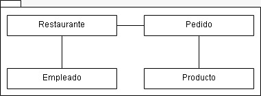
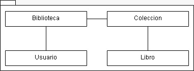
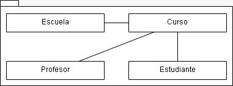
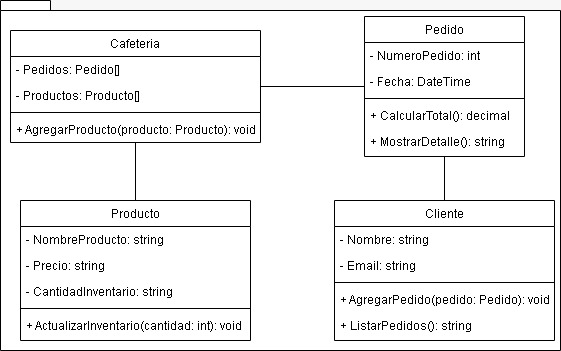
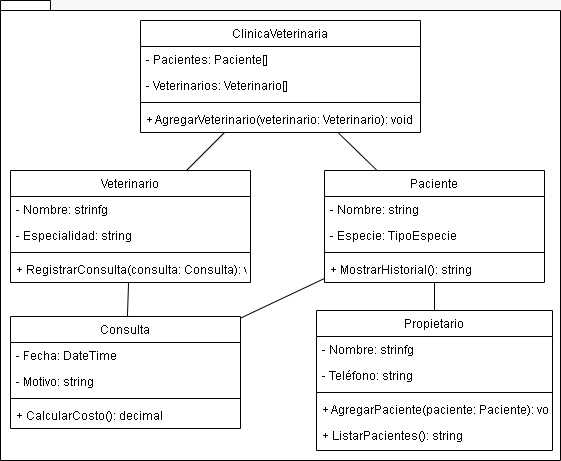

  <h1>GLOBALIZADOR PROG. 2</h1>

## 1 Analiza y responde

### 1.1. Sistema de Reservas de un Hotel

Un hotel gestiona reservas de habitaciones, donde cada reserva incluye el nombre del huésped, el tipo de habitación (simple, doble o suite) y la fecha de check-in y check-out. Las tarifas de las habitaciones cambian ocasionalmente, y los datos deben mantenerse actualizados para cada reserva.

#### Preguntas

- **¿Es necesario implementar persistencia para las reservas de habitación?**
- **¿Sería útil usar un Diccionario para los tipos de habitación disponibles?**

### 1.2. Administración de Personal en una Empresa

Una empresa registra a su personal, incluyendo su nombre, número de empleado, departamento y fecha de ingreso. Los departamentos son fijos y no cambian, pero el personal y sus datos sí.

#### Preguntas

- **¿Sería necesario persistir los datos de los empleados?**
- **¿Se requiere un Diccionario para los departamentos?**

#### 1.3. Gestión de Pedidos en una Pizzería

Una pizzería maneja pedidos donde cada pedido incluye el nombre del cliente, tipo de pizza (margarita, pepperoni, vegetariana) y una fecha y hora de entrega. Las pizzas y sus ingredientes son fijos.

#### Preguntas

- **¿Es necesario almacenar la información de los pedidos?**
- **¿Es útil usar un Enum para los tipos de pizza?**

### 1.4. Registro de Pacientes en una Clínica

Una clínica necesita registrar a sus pacientes. Cada paciente tiene un nombre, fecha de nacimiento y motivo de consulta. La clínica también ofrece distintos servicios médicos, que son fijos y no se actualizan con frecuencia.

#### Preguntas

- **¿Es necesario implementar persistencia para almacenar a los pacientes?**
- **¿Qué tipo de colección usarías para los servicios médicos que ofrece la clínica?**

---

## 2. Resuelve los siguientes problemas

### 2.1. Gestión de Pedidos en un Restaurante

En un restaurante, los pedidos de los clientes se gestionan de manera organizada. Cada Restaurante maneja múltiples Pedidos, y cada pedido incluye una serie de Productos específicos que los clientes ordenan. Además, cada pedido es gestionado por un Empleado del restaurante, quien se encarga de que el pedido se complete correctamente. Todos los empleados están asignados directamente al restaurante, aunque pueden ser reasignados a distintos pedidos en función de la demanda.

#### Preguntas

- **¿Qué tipo de relación existe entre Restaurante y Pedido?**
- **¿Qué tipo de relación existe entre Pedido y Producto?**
- **¿Es la relación entre Restaurante y Empleado de tipo composición o agregación?**

  

---

### 2.2. Biblioteca y Colección de Libros

Una Biblioteca organiza sus libros en varias Colecciones para facilitar su clasificación y acceso. Cada colección se agrupa por temas o géneros, y a su vez contiene múltiples Libros. Los Usuarios de la biblioteca pueden consultar y acceder a las colecciones según sus preferencias. La biblioteca centraliza y mantiene el control sobre las colecciones y libros.

#### Preguntas

- **¿Qué tipo de relación existe entre Biblioteca y Coleccion?**
- **¿Qué tipo de relación existe entre Coleccion y Libro?**
- **¿Es la relación entre Biblioteca y Usuario bidireccional o unidireccional?**

  

---

### 2.3. Sistema de Gestión de Cursos en una Escuela

Una Escuela ofrece varios Cursos a los estudiantes. Cada curso es impartido por un Profesor, quien es responsable del contenido y la enseñanza. Además, cada curso tiene una lista de Estudiantes que están inscritos y participan activamente en él. Los profesores están asignados exclusivamente a cursos específicos, pero la escuela sigue siendo quien organiza y mantiene la estructura de los cursos.

#### Preguntas

- **¿Qué tipo de relación existe entre Escuela y Curso?**
- **¿Qué tipo de relación existe entre Curso y Estudiante?**
- **¿Es la relación entre Curso y Profesor de tipo composición o agregación?**

  

---

### 2.4. Sistema de Gestión de Pedidos en una Cafetería

La cafetería “El Grano Perfecto” está desarrollando un sistema para gestionar los pedidos de sus clientes y organizar su inventario de productos. Cada pedido se asocia a un cliente y contiene una lista de productos solicitados. Los productos pueden ser diferentes tipos de café, postres y sándwiches, cada uno con su precio y cantidad en inventario. Los clientes pueden consultar sus pedidos y, al finalizar el día, la cafetería genera un reporte de productos más vendidos.

#### Preguntas

- **¿Cuál atributo falta en la clase Pedido para que pueda relacionarse con la lista de productos solicitados en el pedido?**
- **¿Cuál atributo sería útil en la clase Cliente para manejar los pedidos?**
- **¿Qué atributo faltante en la clase Producto ayudaría a clasificar los productos por tipo?**
- **¿Cuál método faltaría en la clase Producto para mostrar el estado del inventario?**
- **¿Qué métodos adicionales deberían incluirse en la clase Cafeteria para gestionar los pedidos y generar un reporte diario?**

  

---

### 2.5. Sistema de Registro de Pacientes en una Clínica Veterinaria

La clínica veterinaria “Cuidados Animales” quiere desarrollar un sistema de registro para los pacientes que visitan el establecimiento. Cada paciente, ya sea un perro, un gato o un ave, cuenta con un dueño y tiene un historial de visitas en el que se registran las consultas realizadas. La clínica también almacena una lista de veterinarios que atienden a los pacientes y el tipo de consultas que cada veterinario puede realizar.

#### Preguntas

- **¿Qué atributo falta en la clase Paciente para relacionarse con su propietario?**
- **¿Qué atributo sería útil en la clase Propietario para almacenar información sobre las mascotas del propietario?**
- **¿Qué atributo faltaría en la clase Consulta para vincularla con un paciente específico?**
- **¿Qué método adicional en la clase Veterinario podría permitir ver la lista de consultas realizadas por el veterinario?**
- **¿Qué métodos adicionales deberían incluirse en la clase ClinicaVeterinaria para listar a todos los pacientes y propietarios?**

  

---

### 2.6. Sistema de Biblioteca para Reserva de Libros

La biblioteca comunitaria “Lecturas para Todos” está desarrollando un sistema para administrar la reserva y el préstamo de libros a sus miembros. Cada miembro puede reservar y tomar en préstamo varios libros, siempre y cuando los devuelva en la fecha indicada. La biblioteca también cuenta con una colección de libros disponibles para préstamo, organizados por género. Cada libro tiene un autor y una lista de géneros asociados.

#### Preguntas

- **¿Qué atributo falta en la clase Libro para registrar su disponibilidad en la biblioteca?**
- **¿Qué atributo sería útil en la clase Miembro para almacenar las reservas activas del miembro?**
- **¿Qué atributo falta en la clase Reserva para relacionarla con el libro reservado?**
- **¿Qué método faltaría en la clase Miembro para permitirle devolver un libro reservado?**
- **¿Qué métodos adicionales deberían incluirse en la clase Biblioteca para listar los libros disponibles y los miembros registrados?**

  

---

## 3. Preguntas Teóricas

- **¿Qué es la encapsulación y por qué es importante en POO?**
- **¿Qué es la herencia y cuál es su propósito en POO?**
- **¿Qué es el polimorfismo y cómo se aplica en POO?**
- **¿Qué es una interfaz y cómo se diferencia de una clase abstracta?**
